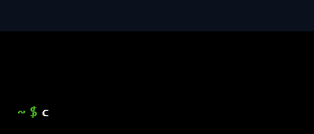

  

 

  
  

<h1 align="center"> 👨‍💻 Whoami</h1>

   
  
 
    Software Engineering Student, Developer, and Tech Enthusiast.  
    With knowledge in Java with Spring Boot, Docker, and proficient in front-end 
    technologies like Angular and React. Also exploring the realms of Golang for 
    a well-rounded skill set.   Well-versed in algorithms, data structures,
    and problem-solving.   Passionate about continuous learning, with a keen 
    interest in Cloud Computing, DevOps practices, and the dynamic world of 
    software engineering
  

   

  <a href="https://github.com/Ru-kko">
    
  <a>

<h1 align="center"> 💻 My proyects</h1>

  
  
  

